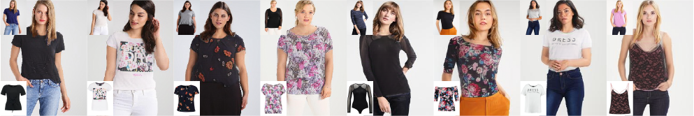

# C-VTON: Context-Driven Image-Based Virtual Try-On Network



### Abstract

Image-based virtual try-on techniques have shown great promise for enhancing the user-experience and improving customer satisfaction on fashion-oriented e-commerce platforms. However, existing techniques are currently still limited in the quality of the try-on results they are able to produce from input images of diverse characteristics. In this work, we propose a Context-Driven Virtual Try-On Network (C-VTON) that addresses these limitations and convincingly transfers selected clothing items to the target subjects even under challenging pose configurations and in the presence
of self-occlusions. At the core of the C-VTON pipeline are: (i) a geometric matching procedure that efficiently aligns the target clothing with the pose of the person in the input images, and (ii) a powerful image generator that utilizes various types of contextual information when synthesizing
the final try-on result. C-VTON is evaluated in rigorous experiments on the VITON and MPV datasets and in comparison to state-of-the-art techniques from the literature. Experimental results show that the proposed approach is able to produce photo-realistic and visually convincing results and
significantly improves on the existing state-of-the-art.

## Requirements

- Python (3.8.10)
- opencv-python (4.5.1.48)
- torch (1.7.1+cu110)
- torchvision (0.8.2+cu110)
- lpips (0.1.4)
- matplotlib (3.3.4)
- pandas (1.2.0)

The experiments were conducted on one (for image resolutions 256×192) or two (for image resolution 512×368) NVIDIA RTX 3090 GPUs.

## Testing

To avoid setting up this repository only to obtain results presented in the paper, please see the generated test results [here]() (for VITON) and [here]() (for MPV). You can find respective test splits alongside provided data [here]() (VITON) and [here]() (MPV).

Running tests yourself requires some setting up to do:
* Install requirements.
* For VITON / VITON-HD: 
    * Download [our preprocessed data]() and extract them to folder `./data/`. Since we are not allowed to share the actual dataset, contact the authors of the [original VITON paper]() and ask them for the full-resolution dataset and download it to appropriate folders.
* For MPV:
    * Download [our preprocessed data]() and extract them to folder `./data/`. Additionally, obtain the MPV dataset *in resolution 256×192* and extract it alongside preprocessed data.
* Download pretrained BPGM model for [VITON](), [VITON-HD]() or [MPV]() and put it in `./bpgm/checkpoints`.
* Download pretrained C-VTON models for [VITON](), [VITON-HD]() or [MPV]() and put it in `./checkpoints`.
* Run test scripts:
```bash
cd C-VTON
python scripts/test_{dataset}.sh
```

Make sure you use our test split to obtain the same results.

## Training

To train the models from scratch, download all aforementioned data and install requirements. Then, similarly to testing, run appropriate scripts from the `scripts` folder:
```bash
cd C-VTON
python scripts/train_{dataset}.sh
```

When training using VITON-HD dataset make sure to delete the second line in `train.py` in order to use all available GPUs.

## Citation

```bib
@InProceedings{Fele_2021_WACV,
    author = {Fele, Benjamin and Lampe, Ajda and Peer, Peter and Struc, Vitomir},
    title = {C-VTON: Context-Driven Image-Based Virtual Try-On Network},
    booktitle = {Proceedings of the IEEE/CVF Winter Conference on Applications of Computer Vision (WACV)},
    month = {January},
    year = {2022}
}
```